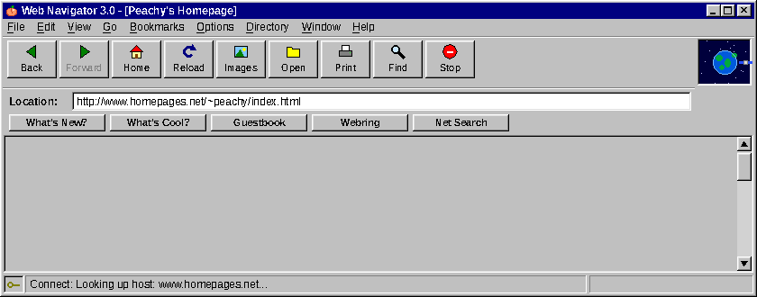
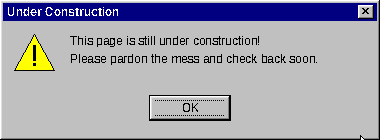

&#x20; 

<b>You have somehow found my github repository. Welcome.  

My love of technology is agnostic of its age, relevance, effectiveness, or societal value. Some think of technology as a ladder, where the new replaces the old, as a strict upgrade. I don't think it works that way!  

A CRT television, a pixel-art sprite, and the Saturn V rocket aren't just old versions of an oled monitor, 3d graphic, or the Space Shuttle. Each one was shaped by the people who made it: their limits, their hopes, and what they thought the future would look like. These inventions in turn also affected how people thought. Newer technology gains a lot, but it usually loses something too, and what it loses usually doesn't come back. But I like to try anyway, so here's some stuff I made that blends old and new!

<table>
  <tr>
    <th>Name</th>
    <th>Description</th>
    <th>Status</th>
  </tr>
  <tr>
    <td>📁 <a href="https://github.com/peachykehn/project-one"><b>project-one</b></a> </td>
    <td>Describe your coolest physics project here</td>
    <td>Under construction</td>
  </tr>
  <tr>
    <td>📁 <a href="https://github.com/peachykehn/project-two"><b>project-two</b></a></td>
    <td>An electronics build with way too many LEDs</td>
    <td>Works (mostly)</td>
  </tr>
  <tr>
    <td>📁 <a href="https://github.com/peachykehn/project-three"><b>project-three</b></a></td>
    <td>Something retro: CRTs, pixels, rockets...</td>
    <td>Archived to floppy</td>
  </tr>
</table>

<a href="https://www.spacejam.com/1996/">Space Jam (1996) \&mdash; still online!</a> 
<a href="https://web.archive.org/">The Wayback Machine</a> 
<a href="https://hackaday.com/">Hackaday</a> 
<a href="https://www.nasa.gov/history/">NASA History</a>

  
  
  
   
  
  
  

\&copy; 1993\&ndash;2026 Peachy \&bull; Created on a Sony Fitbit HB-F1XD

